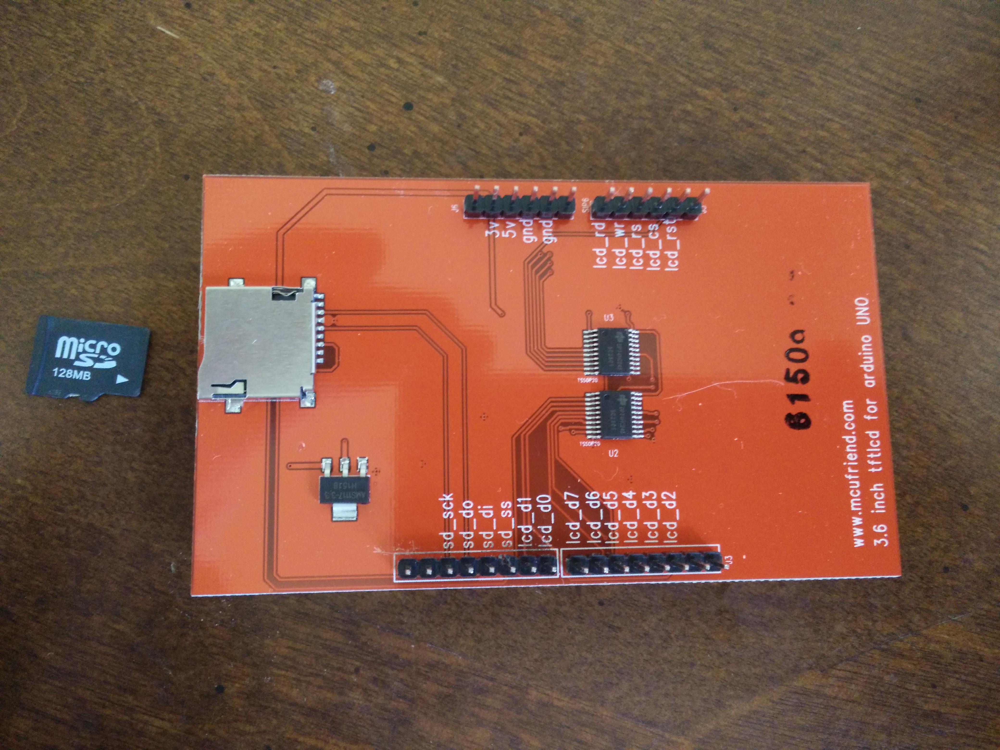

HPDE plastic case, custom cut for this project

Back of main board. Apologies for the blur on this one.

LED strip on right side of board

LED strip on left side of board

Board upper left quad. Note the Left joystick, wifi module and antenna, and main power switch 

Board upper right quad. Note the xbee radio connections and right joystick

Board lower right quad. Note the 2 push button, rotary control, and TX/RX LEDs. Also note the switch on the bottom of the board to select the processor for programming 

Board lower left quad. Note the mini-USB charging port, the battery and connection, and the LED indicators for battery charging and battery charged

Parallax Processor

Main board mounted in the HPDE case

Back of display board, with micro-sd card and slot. Not sure of micro-sd usage at this time.

LCD display assembled on main board

Case cover mounted and finished product

